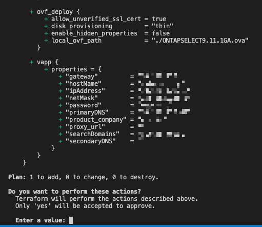

# Automate deployment of ONTAP Select Deploy Instance
This automation deploys the ONTAP Select Deploy instance OVA file with Terraform. 



## pre-reqs

* Terraform https://www.terraform.io/downloads
* NetApp ONTAP Select OVA file https://mysupport.netapp.com/site/products/all/details/ontap-select/downloads-tab

This automation is tested and validated with;

* Terraform v1.2.4
* ONTAPSELECT9.11.1GA.ova

I'm running the automation from my linux jumpbox but should be the same MacOS.

# Run the automation

## Create environment variables

Rename the file `.env_example` to `.env` and adjust the content to your environment. You need to modify credentials and connection properties to your vCenter server.

It's important you specify the correct OVA file path on your local system `TF_VAR_local_ovf_path="./ONTAPSELECT9.11.1GA.ova"`

The following variables is for the OVA customization 

```
TF_VAR_deploy_password="ontapdeploy-password"
TF_VAR_deploy_product_company="Virtjo Corp"
TF_VAR_deploy_proxy_url=""
TF_VAR_deploy_ipaddress="10.128.128.15"
TF_VAR_deploy_netmask="255.255.255.0"
TF_VAR_deploy_gateway="10.128.128.1"
TF_VAR_deploy_hostname="ontapdeploy"
TF_VAR_deploy_dns1="10.128.128.40"
TF_VAR_deploy_dns2=""
TF_VAR_deploy_searchDomains="virtjo.local"
```

## Deploy!

1. Make sure you have all the pre-reqs
2. Make sure you have downloaded **ONTAPSELECT9.11.1GA.ova** and specified the correct path in your `.env` file.
    `TF_VAR_local_ovf_path="./ONTAPSELECT9.11.1GA.ova"`
3. Load your environment variables with `export $(xargs < .env)`
4. Run the automation with `terraform apply`

6. Now you've deployed the ONTAP Select Deploy instance and you can browse to the IP you specified in the variables.


Read more about ONTAP Select on https://docs.netapp.com/us-en/ontap-select/

You can now proceed to push your ONTAP Select nodes from the web interface


